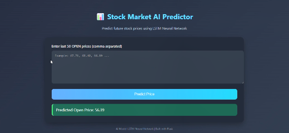
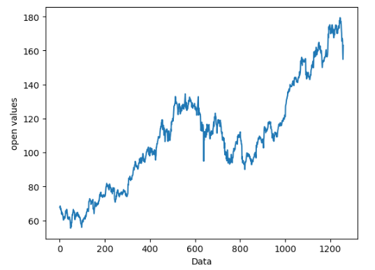
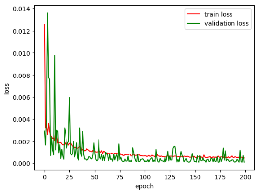
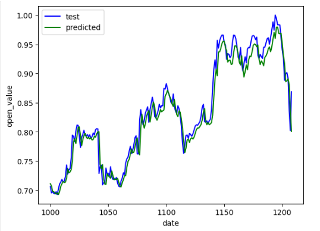

# 📊 Stock Market Price Prediction Using LSTM 

A Deep learning web application that predicts stock prices using an **LSTM neural network** and displays results through a **Flask-based web dashboard** with visualization support.

---
## 🚀 Live Demo / UI Preview

> 🧠 The web interface allows users to input stock data and get predicted values instantly.

---
## 📈 Dataset Overview (Open Price Trend)

> This graph shows historical **AAPL open price variation** used for training the model.

---
## 🧠 Model Training Performance

### 📉 Loss vs Epochs

> The model was trained using LSTM with MSE loss function. The graph shows convergence over epochs.

---
## 📊 Prediction Results

### 📈 Actual vs Predicted Stock Prices

> Comparison between real stock prices and model predictions on test data.

---

## 🚀 Features

- 📈 LSTM-based stock price prediction
- 📊 Actual vs Predicted stock visualization
- 🌐 Flask web interface
- 🧠 Data preprocessing using MinMaxScaler
- 💾 Saved trained model (`.keras`)
- 📉 Performance analysis

---

## 🏗️ Tech Stack

- Python
- TensorFlow / Keras
- Flask
- Pandas
- NumPy
- Scikit-learn
- Matplotlib
- HTML + CSS

---

